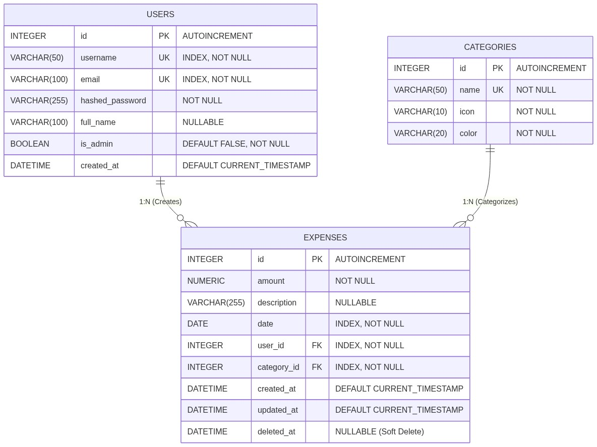

# Database Systems Project Report: Expense Tracker

> [!NOTE]
> This document details the database architecture, design choices, and implementation specifics of the Full-Stack Expense Tracker application. It serves as a comprehensive demonstration of Relational Database Management System (RDBMS) concepts, utilizing **PostgreSQL** and **SQLAlchemy 2.0**.

---

## 1. Application Visualizations

The application combines a visually stunning Emerald and Teal theme with responsive glassmorphism. Below are key demonstrations of the database layers directly rendering user analytics.

### Public Landing & Registration

<br>


### Standard User Dashboard (Rendering Expense Aggregation)


### Administrative Panel (Cross-User Aggregation Joins)

<br>


---

## 2. Entity-Relationship (ER) Architecture

The database is built on a normalized relational schema connecting Users to their mapped Expenses and abstracting classifications into reusable Categories.



---

## 3. Database Normalization & Integrity

The schema adheres strictly to **Third Normal Form (3NF)** to eliminate redundancy and prevent data anomalies during insertion, updates, and deletion.

### Normalization Details
1. **First Normal Form (1NF)**: All attributes contain atomic values. We do not store comma-delimited multiple categories within an expense; instead, each distinct expense maps singularly to its metadata.
2. **Second Normal Form (2NF)**: All non-key attributes are fully functionally dependent on the entire primary key constraint natively across all tables.
3. **Third Normal Form (3NF)**: Transitive dependencies are removed. 
   - *Example*: Instead of storing `category_name`, `category_icon`, and `category_color` directly in every `expenses` row, we store a single integer `category_id` that references the `Categories` table. Updating a category's color cascades visually to all historical expenses entirely via relationship logic without physically updating 10,000 expense records.

### Data Integrity Constraints
*   **Entity Integrity**: Every table enforces a Primary Key (`id`).
*   **Referential Integrity**: `Expenses` utilize Foreign Keys (`user_id`, `category_id`). Attempting to log an expense with a non-existent category generates a hard SQL Foreign Key violation.
*   **Domain Integrity**: Constraints such as `UNIQUE` natively guard against duplicate email or username registrations.

> [!TIP]
> **Soft Deletion Strategy**: We utilize a `deleted_at` timestamp rather than physically truncating or executing hard `DELETE` commands on expense records. This ensures referential audit data is never destroyed natively. Read queries are manually appended with `.filter(Expense.deleted_at.is_(None))`.

---

## 4. Core API Queries & Joins

The backend offloads calculation and summation mathematics to the Postgres Database Engine natively rather than leaning on application-level Python scripts. 

### A. Inner Joins: Category Distribution
*Used globally to generate the Doughnut Pie Chart categorizing user spending habits.*

**Concept:** Joining `expenses` and `categories` to group totals natively via their shared foreign IDs.

```sql
SELECT 
    categories.name, 
    categories.icon, 
    SUM(expenses.amount) as total
FROM expenses
INNER JOIN categories 
    ON expenses.category_id = categories.id
WHERE expenses.deleted_at IS NULL AND expenses.user_id = :user_id
GROUP BY categories.name, categories.icon
ORDER BY total DESC;
```

### B. Left Outer Joins: Cross-User Ranking
*Used exclusively in the Admin Dashboard (`admin_service.py`) to rank software users mathematically.*

**Concept:** Utilizing a `LEFT OUTER JOIN` dictates that **all users** emerge within the output set, even if they currently possess 0 submitted expenses. Then, we use `COALESCE` to turn `NULL` sum queries into absolute zero natively.

```sql
SELECT 
    users.username, 
    COALESCE(SUM(expenses.amount), 0) AS total, 
    COUNT(expenses.id) AS count 
FROM users 
LEFT OUTER JOIN expenses 
    ON expenses.user_id = users.id AND expenses.deleted_at IS NULL 
GROUP BY users.id, users.username 
ORDER BY total DESC;
```

### C. Advanced Temporal Processing (EXTRACT)
*Used heavily across Dashboard endpoints to generate Monthly Bar and Line trends spanning quarters.*

**Concept:** This bypasses messy Python date loops and forces Postgres to extract integers directly out of Date columns native elements.

```sql
SELECT 
    EXTRACT(year FROM expenses.date) AS year, 
    EXTRACT(month FROM expenses.date) AS month, 
    SUM(expenses.amount) AS total
FROM expenses
WHERE expenses.deleted_at IS NULL
GROUP BY 
    EXTRACT(year FROM expenses.date), 
    EXTRACT(month FROM expenses.date);
```

### D. Eager Loading Relationships
*Used to halt the severe "N+1 Query Issue" common within standard ORM implementations.*

When calling the "Recent Activity" API endpoint, rather than allowing SQLAlchemy to lazily fetch the linked category for 15 different expenses (which executes 16 total queries), we `joinedload()` it perfectly to fetch the parent relationships alongside the target simultaneously within exactly 1 single query.

*(Implemented directly inside `admin_service.py` -> `get_recent_activity()`)*

---

## 5. Indexing & Query Optimizations

To guarantee Sub-Millisecond database retrieval processing speeds despite scaled environment growth, structural indices are natively engineered to intercept queries.

| B-Tree Index Target | Architectural Reasoning | Direct Impact on APIs |
| :--- | :--- | :--- |
| **`Users.username`** | Secure user identification | Stops Full Table Scans inside `/login` Auth endpoints |
| **`Expenses.date`** | Temporal logic filters | Powers rapid analytics queries isolating ranges (Daily/Monthly view filters) |
| **`Expenses.user_id`** | Relational privacy walls | Enforces isolated multitenancy fetching 1 user's specific data out of millions instantly |

> [!IMPORTANT]
> **Schema Migrations**: 
> Database schemas invariably evolve alongside API development natively (i.e. adding an administrative capability). All relational mutations and rollback actions are maintained perfectly under source control via **Alembic**, generating immutable database migration scripts attached to all production drops.
