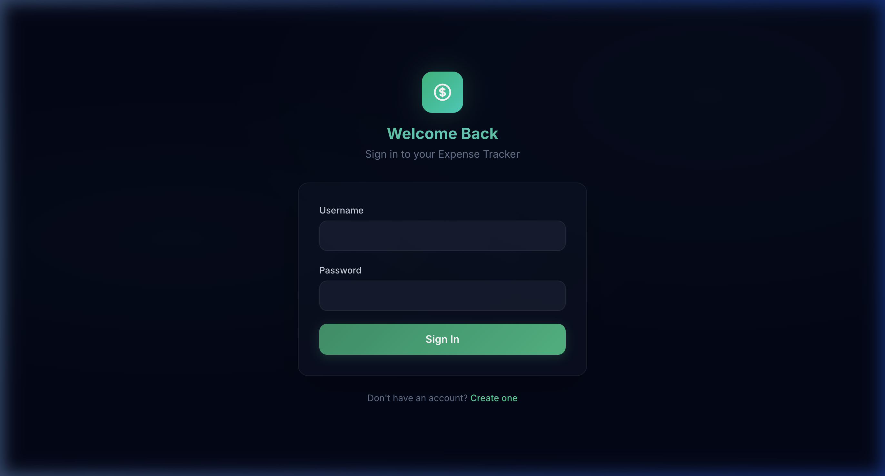
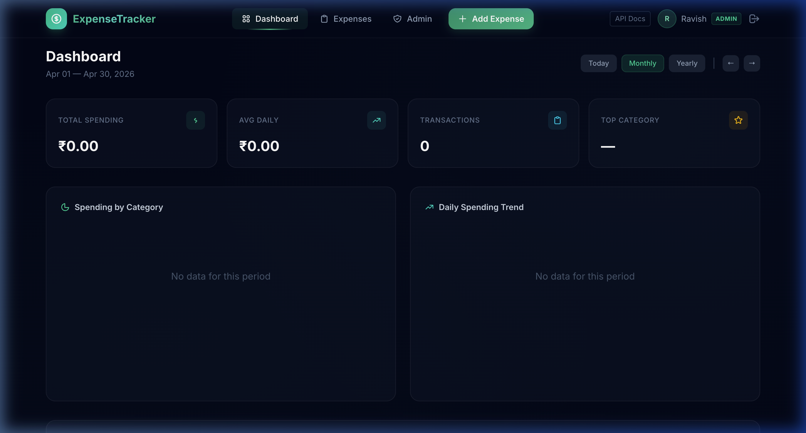
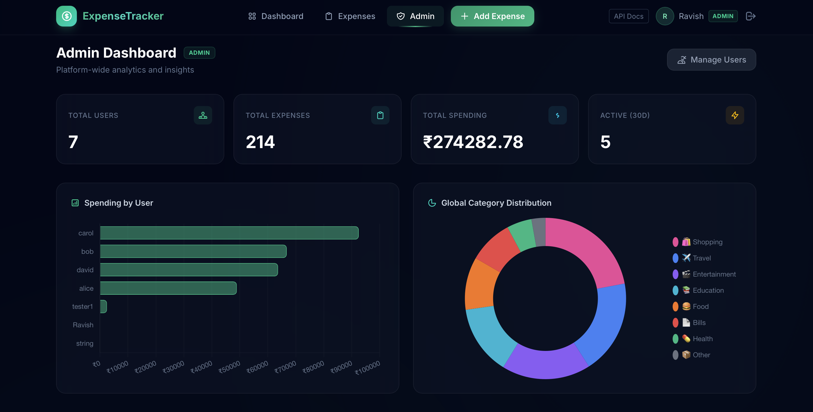
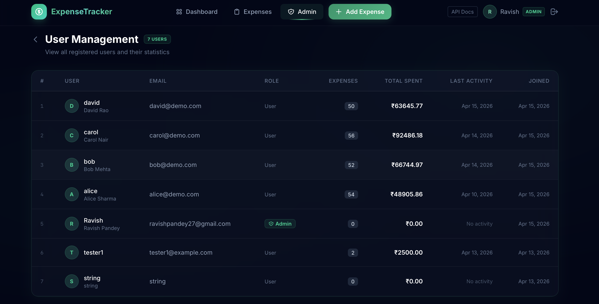

# DBMS Lab Project Report
## ExpenseTracker — Full-Stack Personal Finance Application

> **Course:** Database Management Systems Lab  
> **Stack:** FastAPI · PostgreSQL 16 · SQLAlchemy 2.0 · Alembic · Jinja2 · Tailwind CSS

---

## Table of Contents

1. [Project Overview](#1-project-overview)
2. [Database Schema Design](#2-database-schema-design)
3. [Entity-Relationship Model](#3-entity-relationship-model)
4. [Normalization](#4-normalization)
5. [Integrity Constraints](#5-integrity-constraints)
6. [Indexing Strategy](#6-indexing-strategy)
7. [Core SQL Queries & Joins](#7-core-sql-queries--joins)
8. [Analytics Queries](#8-analytics-queries)
9. [Admin Analytics — Cross-User Queries](#9-admin-analytics--cross-user-queries)
10. [Soft Delete Pattern](#10-soft-delete-pattern)
11. [ORM & Query Optimization](#11-orm--query-optimization)
12. [Schema Migrations (Alembic)](#12-schema-migrations-alembic)
13. [Application Screenshots](#13-application-screenshots)

---

## 1. Project Overview

**ExpenseTracker** is a production-quality web application built to demonstrate real-world RDBMS implementation. Users can log personal expenses, categorize them, and view interactive analytics across daily, monthly, and yearly timeframes. An admin role enables platform-wide monitoring across all users.

The backend exposes both a **server-rendered HTML interface** (Jinja2 + Tailwind) and a **full JSON REST API** (`/api/v1/*`) with OpenAPI documentation.

**Key DBMS concepts demonstrated:**
- Relational schema design with normalization (1NF → 3NF)
- Primary keys, foreign keys, unique constraints
- INNER JOIN, LEFT OUTER JOIN, GROUP BY, HAVING
- Aggregate functions: `SUM`, `COUNT`, `MAX`, `COALESCE`
- Temporal extraction: `EXTRACT(year/month FROM date)`
- Indexing for query performance
- Soft delete via nullable timestamp column
- Schema version control with Alembic

---

## 2. Database Schema Design

The application uses **three tables**. Below is the full schema as implemented in SQLAlchemy ORM and reflected in PostgreSQL.

### `users`

| Column | Type | Constraints |
|---|---|---|
| `id` | `SERIAL` | `PRIMARY KEY` |
| `username` | `VARCHAR(50)` | `UNIQUE`, `NOT NULL`, Indexed |
| `email` | `VARCHAR(100)` | `UNIQUE`, `NOT NULL`, Indexed |
| `hashed_password` | `VARCHAR(255)` | `NOT NULL` |
| `full_name` | `VARCHAR(100)` | Nullable |
| `is_admin` | `BOOLEAN` | `NOT NULL`, `DEFAULT FALSE` |
| `created_at` | `TIMESTAMP` | `DEFAULT now()` |

### `categories`

| Column | Type | Constraints |
|---|---|---|
| `id` | `SERIAL` | `PRIMARY KEY` |
| `name` | `VARCHAR(50)` | `UNIQUE`, `NOT NULL` |
| `icon` | `VARCHAR(10)` | `NOT NULL` (emoji) |
| `color` | `VARCHAR(20)` | `NOT NULL` (hex code) |

### `expenses`

| Column | Type | Constraints |
|---|---|---|
| `id` | `SERIAL` | `PRIMARY KEY` |
| `amount` | `NUMERIC(10,2)` | `NOT NULL` |
| `description` | `VARCHAR(255)` | Nullable |
| `date` | `DATE` | `NOT NULL`, Indexed |
| `user_id` | `INTEGER` | `FOREIGN KEY → users(id)`, Indexed |
| `category_id` | `INTEGER` | `FOREIGN KEY → categories(id)`, Indexed |
| `created_at` | `TIMESTAMP` | `DEFAULT now()` |
| `updated_at` | `TIMESTAMP` | `DEFAULT now()`, auto-updated |
| `deleted_at` | `TIMESTAMP` | Nullable — **soft delete flag** |

---

## 3. Entity-Relationship Model

```
┌─────────────────────┐          ┌──────────────────────────────────┐
│        USERS         │          │              EXPENSES              │
├─────────────────────┤          ├──────────────────────────────────┤
│ PK  id              │◄─────────┤ FK  user_id (NOT NULL, INDEX)    │
│     username (UNIQUE)│  1  :  N │ FK  category_id (NOT NULL, INDEX)│
│     email    (UNIQUE)│          │ PK  id                           │
│     hashed_password  │          │     amount   NUMERIC(10,2)        │
│     full_name        │          │     description                   │
│     is_admin BOOL    │          │     date     DATE (INDEX)        │
│     created_at       │          │     created_at                    │
└─────────────────────┘          │     updated_at                    │
                                  │     deleted_at  ← soft delete    │
┌────────────────────┐           └──────────────────────────────────┘
│     CATEGORIES     │                           ▲
├────────────────────┤                           │ 1 : N
│ PK  id             │◄──────────────────────────┘
│     name   (UNIQUE)│
│     icon           │
│     color          │
└────────────────────┘

Relationships:
  USERS      ──< EXPENSES   (One-to-Many: a user has many expenses)
  CATEGORIES ──< EXPENSES   (One-to-Many: a category applies to many expenses)
```

For a visual ER diagram, see [`docs/images/er_diagram.png`](./docs/images/er_diagram.png).

---

## 4. Normalization

### First Normal Form (1NF)
All attributes store **atomic, single-valued data**. Categories are not stored as a comma-separated string inside `expenses`; instead, each expense maps to exactly one `category_id` (a single integer). This eliminates repeating groups.

### Second Normal Form (2NF)
All tables use a **single-column primary key** (`id`), so there are no partial dependencies by definition. Every non-key attribute depends entirely on `id`.

### Third Normal Form (3NF)
**Transitive dependencies are eliminated.** Without normalization, storing `category_name`, `category_icon`, and `category_color` directly in every expense row would introduce a transitive dependency: `expense_id → category_id → category_name`. 

Instead, these attributes live in the `categories` table. The `expenses` table stores only `category_id`, removing the transitive chain.

**Practical benefit:** Renaming a category (e.g., "Food" → "Dining") requires updating exactly **one row** in `categories`, not thousands of expense records.

---

## 5. Integrity Constraints

### Entity Integrity
Every table declares a `PRIMARY KEY` (`id` with `AUTOINCREMENT`). No primary key column can be `NULL`.

### Referential Integrity
The `expenses` table enforces two foreign key constraints:

```sql
FOREIGN KEY (user_id)     REFERENCES users(id)
FOREIGN KEY (category_id) REFERENCES categories(id)
```

Inserting an expense with a non-existent `category_id` raises a PostgreSQL foreign key violation. The API layer validates this explicitly before insert:

```python
cat = category_service.get_category_by_id(db, data.category_id)
if not cat:
    raise HTTPException(status_code=400, detail="Invalid category_id")
```

### Domain Integrity
- `UNIQUE` on `users.username` and `users.email` prevents duplicate registrations.
- `UNIQUE` on `categories.name` prevents category name collisions.
- `NOT NULL` constraints on required fields enforce completeness at the DB level.
- `amount` is typed as `NUMERIC(10,2)` — exactly 2 decimal places, no floating-point imprecision.

### Role Integrity
The `is_admin` boolean (`DEFAULT FALSE`) is the single source of truth for access control. FastAPI's `get_current_admin` dependency reads this flag from the database on every request to protected routes — it cannot be spoofed via JWT alone.

---

## 6. Indexing Strategy

Indexes are B-Tree by default in PostgreSQL and are applied strategically to columns that appear in `WHERE`, `JOIN ON`, and `ORDER BY` clauses.

| Index | Column(s) | Query Pattern | Benefit |
|---|---|---|---|
| Auto (PK) | `users.id`, `expenses.id`, `categories.id` | All lookups by ID | O(log n) row fetch |
| Unique Index | `users.username` | `WHERE username = ?` (login) | Stops full table scan on auth |
| Unique Index | `users.email` | `WHERE email = ?` (registration) | Stops full table scan on duplicate check |
| Explicit Index | `expenses.user_id` | `WHERE user_id = ?` (all user queries) | Isolates per-user data in O(log n) |
| Explicit Index | `expenses.date` | `WHERE date BETWEEN ? AND ?` (all analytics) | Range scan instead of full scan |
| Explicit Index | `expenses.category_id` | JOIN on category | Speeds up category distribution queries |

**Without** the `expenses.date` index, every analytics query (dashboard summary, monthly trends) would require a full sequential scan across the entire expenses table — unacceptable at scale.

---

## 7. Core SQL Queries & Joins

All queries are executed via SQLAlchemy ORM. The equivalent raw SQL is shown alongside for clarity.

### 7.1 — Retrieve User Expenses with Filtering, Sorting & Pagination

Used by `GET /api/v1/expenses` and the Expenses list page.

```sql
SELECT expenses.*, categories.name, categories.icon, categories.color
FROM expenses
JOIN categories ON expenses.category_id = categories.id
WHERE expenses.user_id = :user_id
  AND expenses.deleted_at IS NULL
  AND expenses.date >= :start_date      -- optional
  AND expenses.date <= :end_date        -- optional
  AND expenses.category_id = :cat_id    -- optional
ORDER BY expenses.date DESC
LIMIT :per_page OFFSET :offset;
```

**INNER JOIN** here is correct — every expense must have a valid category (enforced by FK). The `joinedload()` ORM hint fetches the category in the same query, preventing N+1 queries.

### 7.2 — Single Expense Lookup with Ownership Check

```sql
SELECT expenses.*, categories.*
FROM expenses
JOIN categories ON expenses.category_id = categories.id
WHERE expenses.id = :expense_id
  AND expenses.user_id = :user_id        -- ownership guard
  AND expenses.deleted_at IS NULL;
```

The `user_id` filter is a critical **security boundary** — users can only access their own data.

### 7.3 — Soft Delete & Restore

**Delete** (sets timestamp, never removes the row):
```sql
UPDATE expenses
SET deleted_at = NOW()
WHERE id = :expense_id AND user_id = :user_id;
```

**Restore** (clears the timestamp):
```sql
UPDATE expenses
SET deleted_at = NULL
WHERE id = :expense_id
  AND user_id = :user_id
  AND deleted_at IS NOT NULL;
```

---

## 8. Analytics Queries

All analytics are computed database-side, not in Python. This leverages PostgreSQL's query engine for aggregation over arbitrarily large datasets.

### 8.1 — Total Spending (SUM + COALESCE)

```sql
SELECT COALESCE(SUM(amount), 0)
FROM expenses
WHERE user_id = :user_id
  AND date >= :start_date
  AND date <= :end_date
  AND deleted_at IS NULL;
```

`COALESCE` converts `NULL` (no expenses in range) to `0` so the application always receives a numeric value.

### 8.2 — Spending by Category (INNER JOIN + GROUP BY)

Powers the **donut chart** on the dashboard.

```sql
SELECT 
    categories.name,
    categories.icon,
    categories.color,
    SUM(expenses.amount)  AS total,
    COUNT(expenses.id)    AS count
FROM expenses
JOIN categories ON expenses.category_id = categories.id
WHERE expenses.user_id = :user_id
  AND expenses.date BETWEEN :start_date AND :end_date
  AND expenses.deleted_at IS NULL
GROUP BY categories.name, categories.icon, categories.color
ORDER BY total DESC;
```

### 8.3 — Daily Spending Trend (GROUP BY date)

Powers the **line chart** on the dashboard.

```sql
SELECT 
    date,
    SUM(amount) AS total
FROM expenses
WHERE user_id = :user_id
  AND date BETWEEN :start_date AND :end_date
  AND deleted_at IS NULL
GROUP BY date
ORDER BY date ASC;
```

### 8.4 — Monthly Comparison (EXTRACT + GROUP BY)

Powers the **6-month bar chart** on the dashboard.

```sql
SELECT
    EXTRACT(year  FROM date) AS year,
    EXTRACT(month FROM date) AS month,
    SUM(amount)              AS total,
    COUNT(id)                AS count
FROM expenses
WHERE user_id = :user_id
  AND date >= :cutoff
  AND deleted_at IS NULL
GROUP BY
    EXTRACT(year  FROM date),
    EXTRACT(month FROM date)
ORDER BY year ASC, month ASC;
```

`EXTRACT` decomposes the `DATE` column into integer year and month components, enabling aggregation by calendar month across year boundaries.

### 8.5 — Top N Expenses

```sql
SELECT expenses.*, categories.*
FROM expenses
JOIN categories ON expenses.category_id = categories.id
WHERE user_id = :user_id
  AND date BETWEEN :start_date AND :end_date
  AND deleted_at IS NULL
ORDER BY amount DESC
LIMIT :n;
```

---

## 9. Admin Analytics — Cross-User Queries

The admin panel runs queries **across all users**, requiring more complex join patterns.

### 9.1 — Platform Statistics

```sql
-- Total users
SELECT COUNT(id) FROM users;

-- Total active expenses
SELECT COUNT(id) FROM expenses WHERE deleted_at IS NULL;

-- Total platform spending
SELECT COALESCE(SUM(amount), 0) FROM expenses WHERE deleted_at IS NULL;

-- Active users in last 30 days
SELECT COUNT(DISTINCT user_id)
FROM expenses
WHERE deleted_at IS NULL AND date >= CURRENT_DATE - INTERVAL '30 days';
```

### 9.2 — Spending by User (LEFT OUTER JOIN + COALESCE)

Powers the **horizontal bar chart** comparing user spending. Uses `LEFT OUTER JOIN` to include users who have **zero expenses** — they must still appear in the result set.

```sql
SELECT
    users.username,
    COALESCE(SUM(expenses.amount), 0) AS total,
    COUNT(expenses.id)                AS count
FROM users
LEFT OUTER JOIN expenses
    ON expenses.user_id = users.id
    AND expenses.deleted_at IS NULL    -- join condition, not WHERE filter
GROUP BY users.id, users.username
ORDER BY total DESC;
```

> **Why the soft-delete filter is in the JOIN condition, not WHERE:**  
> If `AND expenses.deleted_at IS NULL` were in the `WHERE` clause, users with zero expenses would be excluded (their expense columns are `NULL` from the outer join, failing the `WHERE` filter). Placing it in the `ON` clause keeps all users in the result regardless.

### 9.3 — Global Category Distribution (INNER JOIN + GROUP BY across all users)

```sql
SELECT
    categories.name,
    categories.icon,
    categories.color,
    SUM(expenses.amount) AS total,
    COUNT(expenses.id)   AS count
FROM expenses
JOIN categories ON expenses.category_id = categories.id
WHERE expenses.deleted_at IS NULL
GROUP BY categories.name, categories.icon, categories.color
ORDER BY total DESC;
```

### 9.4 — Monthly Platform Trend (EXTRACT + COUNT DISTINCT)

```sql
SELECT
    EXTRACT(year  FROM date) AS year,
    EXTRACT(month FROM date) AS month,
    SUM(amount)              AS total,
    COUNT(id)                AS count,
    COUNT(DISTINCT user_id)  AS active_users
FROM expenses
WHERE date >= :cutoff
  AND deleted_at IS NULL
GROUP BY EXTRACT(year FROM date), EXTRACT(month FROM date)
ORDER BY year, month;
```

`COUNT(DISTINCT user_id)` counts unique users who contributed expenses each month — a platform engagement metric.

### 9.5 — Recent Activity Feed (Eager Loading multiple relationships)

```python
db.query(Expense)
  .options(
      joinedload(Expense.category),
      joinedload(Expense.user)      # loads username/email alongside
  )
  .filter(Expense.deleted_at.is_(None))
  .order_by(Expense.created_at.desc())
  .limit(20)
  .all()
```

Without `joinedload()`, accessing `expense.category.name` and `expense.user.username` for 20 rows would trigger **41 additional queries** (N+1 problem). Eager loading collapses this into **1 query** with two JOINs.

---

## 10. Soft Delete Pattern

Expenses are **never physically deleted**. Instead, a `deleted_at` timestamp column (nullable) marks deletion:

| State | `deleted_at` value |
|---|---|
| Active | `NULL` |
| Deleted | `2026-04-15 14:32:00 UTC` |

**Every read query** in `expense_service.py` includes:
```python
.filter(Expense.deleted_at.is_(None))
```

**Advantages:**
- Preserves a full audit trail — no data is ever lost
- Allows accidental-deletion recovery via `POST /api/v1/expenses/{id}/restore`
- Referential integrity remains intact (no FK orphaning)
- Analytics over historical data remains accurate

---

## 11. ORM & Query Optimization

### SQLAlchemy Session (Unit of Work)
All database mutations follow the Unit of Work pattern:
```python
db.add(expense)
db.commit()
db.refresh(expense)  # reloads from DB to get generated values
```

Transactions are atomic — a failed `commit()` rolls back automatically, preserving consistency.

### Eager Loading (joinedload)
Prevents the N+1 query problem on all expense-list endpoints:
```python
.options(joinedload(Expense.category))
```
This issues a single `JOIN` query instead of one query per expense to fetch its category.

### Pagination
All list queries use `LIMIT` + `OFFSET` to avoid loading the full dataset:
```python
offset = (page - 1) * per_page
query.offset(offset).limit(per_page)
```

---

## 12. Schema Migrations (Alembic)

Database schema changes are managed by **Alembic**, keeping the schema in sync with ORM models without manual `ALTER TABLE` statements.

**Migration history:**
1. `1b39b7d97d54` — initial schema (users, categories, expenses)
2. `899aed0a89a8` — `add_is_admin_to_users` (admin role support)

**Commands:**
```bash
# Apply all pending migrations
alembic upgrade head

# Roll back one migration
alembic downgrade -1

# Generate a new migration from model changes
alembic revision --autogenerate -m "description"

# View migration history
alembic history
```

Each migration file contains reversible `upgrade()` and `downgrade()` functions, making schema evolution safe and version-controlled alongside code in Git.

---

## 13. Application Screenshots

### Public Landing Page


### Login Page


### User Dashboard — Analytics & Charts


### Admin Dashboard — Platform-Wide Insights


### Admin User Management

